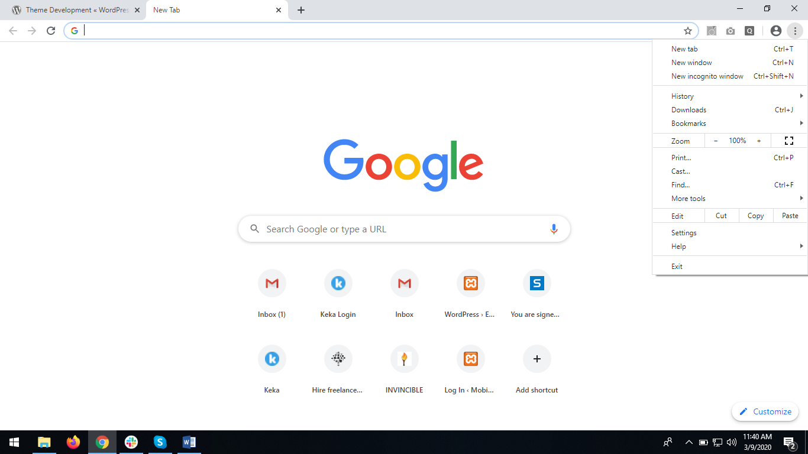
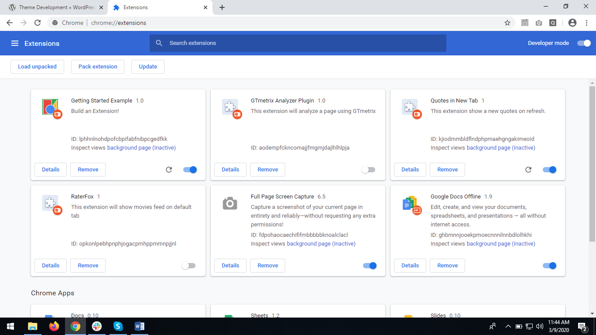
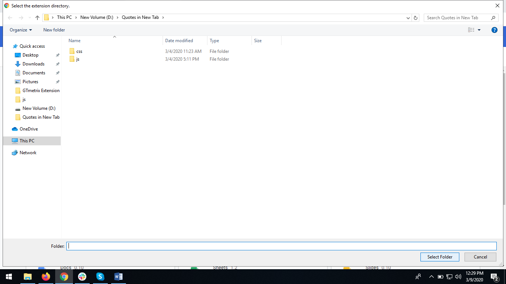
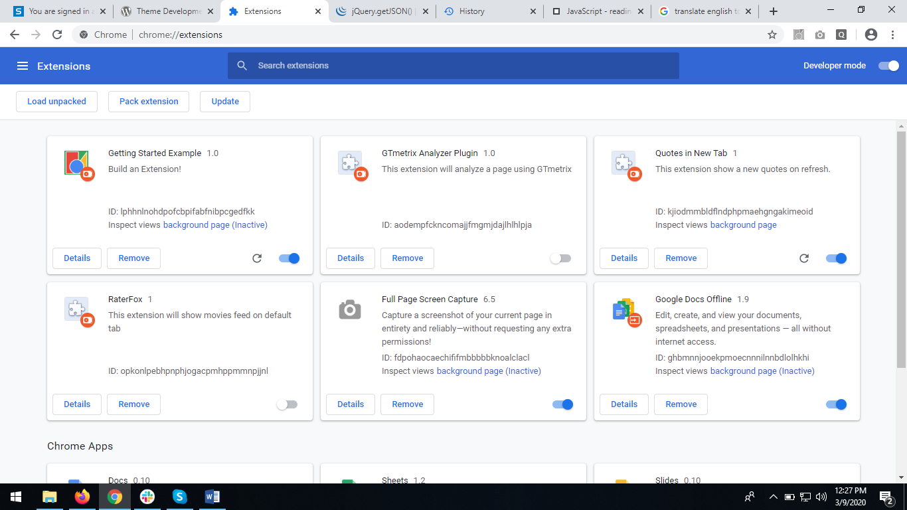

## Requirements for Quotes Extension for Chrome
1. Create a chrome extension that shows quotes.
2. Show quotes in popup on clicking extension icon.

## Additional requirement
1. Redirect to external url on extension uninstall.
2. Show quote popup automatically when new tab opens.

## Basic steps for creating chrome extension
1. Create one folder and give your extension name to it.
2. In that folder create manifest.json file which is must to create an extension.
3. In curly bracket write down,

```
	{
	    "name": "Your extension name",
	    "version": "1.0", //version of your extension
	    "description": "Build an Extension!", //to describe your extension
	    "manifest_version": 2 //must include this otherwise your chrome extension will give error
	  }
```

4. Save file.
5. Open chrome -> open setting menu -> click on more tools.



6. Then click on extension which will open extensions window.


7. To load your extension in browser enable developer mode.


8. Then click on load unpacked and select your extension folder.



9. Click on select folder.



10. Your extension is loaded in chrome!



## How to create quotes extension for chrome?
1. Files required for this extension,
   - Quotes api: 
     Quotes api to fetch data from it and show in extension

   - Manifest.json: 
     To create chrome extension this file is required with its basic required attributes (Refer basic steps for creating chrome extension)

   - Html file: 
     To show activity on your extension

   - Js/css files: 
     Js file to fetch the api using jquery or any other script
     Css to stylize your appearance of html file

2. Create manifest.json file and mention required details like manifest_version, name, version and description.
3. If you want to open popup on click of extension icon then you have to mention “browser_action” in manifest.json and put your html file as “default_popup”.

```
	"browser_action": {
	   "default_popup": "quotes.html"
	},
```

4. Background files in manifest file to run in background for redirect url on uninstall.

```
	"background": {
	    "scripts": ["js/uninstall.js"],
	    "persistent": false
	}
```

5. Create html file which will show quote in popup.
6. Create quote.js file which fetches data from api and shown using html file.

```
	$.getJSON('https://favqs.com/api/qotd', function(data) {
        
        	var quote = `<h2>"${data.quote.body}"</h2>`
	        $(".quotes").html(quote);

	        var author = `- ${data.quote.author}<br>`
	        $(".quote-author").html(author);
	});
```

7. Create uninstall.js which will run background script and fires event for redirect url on uninstall.

```
	chrome.runtime.setUninstallURL("http:/your url")
```

## For any further information or developer guide you can visit: 

https://developer.chrome.com/extensions

## Quotes API

https://favqs.com/api/qotd

## To fetch api data

http://zetcode.com/javascript/jsonurl/

## What challenges I have face during this?

1. How to create chrome extension?
2. Find quotes api and fetch data from api.
3. How to redirect on external url after extension uninstall?
4. Auto popup open on new tab.