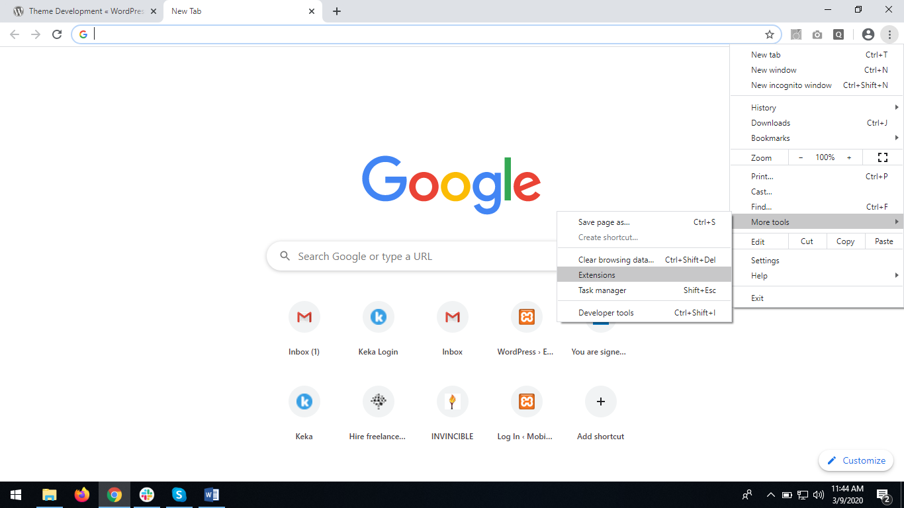

## Basic steps for creating chrome extension
1. Create one folder and give your extension name to it.
2. In that folder create manifest.json file which is must to create an extension.
3. In curly bracket write down,

```
	{
	    "name": "Your extension name",
	    "version": "1.0", //version of your extension
	    "description": "Build an Extension!", //to describe your extension
	    "manifest_version": 2 //must include this otherwise your chrome extension will give error
	  }
```

4. Save file.
5. Open chrome -> open setting menu -> click on more tools.


6. Then click on extension which will open extensions window.



7. To load your extension in browser enable developer mode.


8. Then click on load unpacked and select your extension folder.


9. Click on select folder.


10. Your extension is loaded in chrome!


## For any further information or developer guide you can visit: 

https://developer.chrome.com/extensions